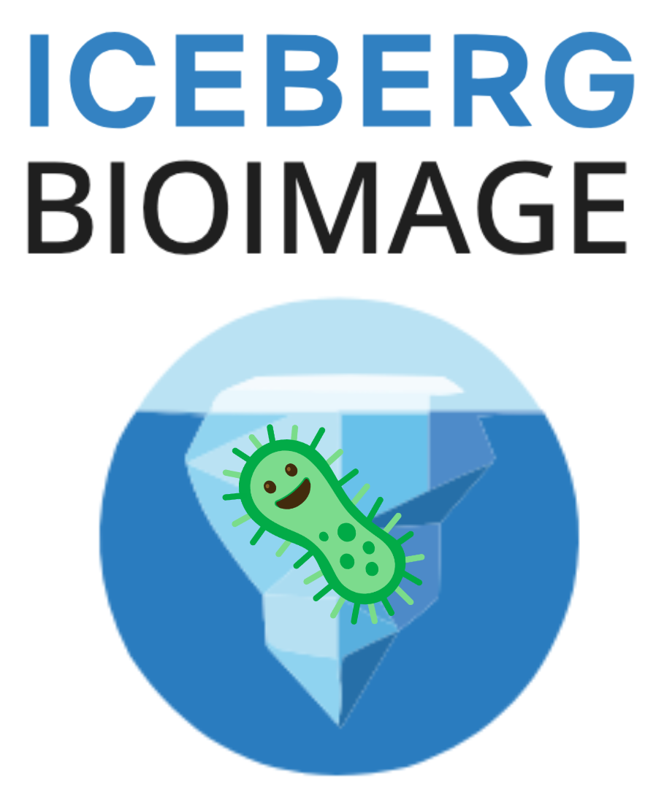

# iceberg-bioimage

`iceberg-bioimage` is a Python package for cataloging bioimaging metadata with Apache Iceberg and exporting Cytomining-compatible warehouse layouts.

It is designed for teams that want:

- Iceberg is the control plane for cataloging, schemas, joins, and snapshots.
- Cytomining-compatible Parquet warehouses are a first-class export target.
- Flexible image data planes, including Zarr, OME-TIFF, and OME-Arrow-centered workflows.
- Adapters that normalize source formats into a single `ScanResult` model.
- Integration with external execution/query tools such as DuckDB, xarray, and tifffile.

## Key capabilities

- Scan supported source stores, including Zarr and OME-TIFF, into canonical `ScanResult` objects.
- Summarize scanned datasets into user-facing `DatasetSummary` objects.
- Publish `image_assets` and `chunk_index` metadata tables with PyIceberg.
- Ingest one or more datasets into Cytotable-compatible Iceberg warehouses.
- Export new or existing datasets into Cytomining-compatible Parquet warehouses.
- Validate profile tables against the microscopy join contract.
- Join scanned image metadata to profile tables through a simple top-level API.
- Query canonical metadata through optional DuckDB helpers.
- Load catalog-backed metadata tables into Arrow for downstream joins.

## Project layout

```text
src/iceberg_bioimage/
  __init__.py
  api.py
  cli.py
  adapters/
  integrations/
  models/
  publishing/
  validation/
```

## Dependencies

Core runtime dependencies include:

- `pyarrow` for Arrow/Parquet table operations
- `pyiceberg` for catalog/table publishing
- `tifffile` for OME-TIFF metadata scanning when OME-TIFF sources are used
- `zarr` for Zarr metadata scanning

Optional integration groups:

- `duckdb` for query helpers and examples
- `ome-arrow` for Arrow-native tabular image payloads and lazy image access

## Getting started

- If you want a catalog-free first run, start with Cytomining export:
  `iceberg-bioimage export-cytomining --warehouse-root warehouse-root data/experiment.zarr`
- If you want Iceberg-backed publishing, configure a PyIceberg catalog first.
- For step-by-step setup, see `docs/src/getting-started.md` and `docs/src/catalog-setup.md`.

## Zarr support

`iceberg-bioimage` keeps the user-facing API simple: use `scan_store(...)` for
both local Zarr v2 stores and local Zarr v3 metadata stores.

- Zarr v2 arrays are scanned through the `zarr` Python package
- Local Zarr v3 stores are scanned from `zarr.json` metadata without requiring
  a separate API
- Summaries report the storage variant as `zarr-v2` or `zarr-v3`
- The base package allows either Zarr 2 or Zarr 3 runtimes so that optional
  forward-facing integrations can coexist in the same environment

## Quickstart

```python
from iceberg_bioimage import (
    export_store_to_cytomining_warehouse,
    ingest_stores_to_warehouse,
    join_profiles_with_store,
    register_store,
    summarize_store,
    validate_microscopy_profile_table,
)

registration = register_store(
    "data/experiment.zarr",
    "default",
    "bioimage.cytotable",
)
print(registration.to_dict())

summary = summarize_store("data/experiment.zarr")
print(summary.to_dict())

contract = validate_microscopy_profile_table("data/cells.parquet")
print(contract.is_valid)

# Requires the optional DuckDB integration:
#   pip install 'iceberg-bioimage[duckdb]'
joined = join_profiles_with_store("data/experiment.zarr", "data/cells.parquet")
print(joined.num_rows)

warehouse = ingest_stores_to_warehouse(
    ["data/experiment-a.zarr", "data/experiment-b.zarr"],
    "default",
    "bioimage.cytotable",
)
print(warehouse.to_dict())

cytomining_export = export_store_to_cytomining_warehouse(
    "data/experiment-a.zarr",
    "warehouse-root",
    profiles="data/cells.parquet",
    profile_dataset_id="experiment-a",
)
print(cytomining_export.to_dict())
```

```bash
iceberg-bioimage scan data/experiment.zarr
iceberg-bioimage summarize data/experiment.zarr
iceberg-bioimage register --catalog default --namespace bioimage.cytotable data/experiment.zarr
iceberg-bioimage ingest --catalog default --namespace bioimage.cytotable data/experiment-a.zarr data/experiment-b.zarr
iceberg-bioimage export-cytomining --warehouse-root warehouse-root data/experiment.zarr
iceberg-bioimage publish-chunks --catalog default --namespace bioimage.cytotable data/experiment.zarr
iceberg-bioimage register --catalog default --namespace bioimage.cytotable --publish-chunks data/experiment.zarr
iceberg-bioimage validate-contract data/cells.parquet
iceberg-bioimage join-profiles data/experiment.zarr data/cells.parquet --output joined.parquet
```

- `examples/quickstart.py` for a minimal scan, publish, and validation script
- `examples/catalog_duckdb.py` for a catalog-backed query workflow
- `examples/synthetic_workflow.py` for a self-contained local workflow

Install optional integrations with:

```bash
pip install 'iceberg-bioimage[duckdb]'
pip install 'iceberg-bioimage[ome-arrow]'
```

## DuckDB helpers

DuckDB is supported as an optional integration layer, not as a required engine.
The join helpers also accept common `pycytominer` and `coSMicQC`-style
`Metadata_*` aliases for `dataset_id`, `image_id`, `plate_id`, `well_id`, and
`site_id`. If a profile table is missing `dataset_id` but all rows belong to
one dataset, pass `profile_dataset_id=...` to the high-level join helpers.

```python
import pyarrow as pa

from iceberg_bioimage import join_image_assets_with_profiles, query_metadata_table

image_assets = pa.table(
    {
        "dataset_id": ["ds-1"],
        "image_id": ["img-1"],
        "array_path": ["0"],
        "uri": ["data/example.zarr"],
    }
)
profiles = pa.table(
    {
        "dataset_id": ["ds-1"],
        "image_id": ["img-1"],
        "cell_count": [42],
    }
)

joined = join_image_assets_with_profiles(image_assets, profiles)
filtered = query_metadata_table(
    joined,
    filters=[("cell_count", ">", 10)],
)
```

Install the optional integration with `uv sync --group duckdb`.

## Cytomining warehouse export

The package supports Cytomining interoperability as a primary workflow.
Besides publishing canonical metadata to Iceberg, it can materialize a
Parquet-backed warehouse root that tools like `pycytominer` can consume
directly.

```python
from iceberg_bioimage import export_store_to_cytomining_warehouse

result = export_store_to_cytomining_warehouse(
    "data/experiment.zarr",
    "warehouse-root",
    profiles="data/profiles.parquet",
    profile_dataset_id="experiment",
)
print(result.to_dict())
```

This writes one or more of:

- `images/image_assets/`
- `images/chunk_index/`
- `profiles/joined_profiles/`

It can also append downstream Cytomining tables into the same warehouse root,
using namespaces that match table semantics, for example:

- `profiles/pycytominer_profiles/`
- `quality_control/cosmicqc_profiles/`

## OME-Arrow helpers

OME-Arrow is available as an optional forward-facing integration for tabular
image payloads stored in Arrow-compatible formats.
Projects may also choose an OME-Arrow-first workflow for source image handling.

```python
from iceberg_bioimage import create_ome_arrow, scan_ome_arrow

oa = create_ome_arrow("image.ome.tiff")
lazy_oa = scan_ome_arrow("image.ome.parquet")
```

Install it with `uv sync --group ome-arrow` or
`pip install 'iceberg-bioimage[ome-arrow]'`.

## Local synthetic workflow

For a catalog-free onboarding path, `examples/synthetic_workflow.py` creates a
small Zarr store and profile table, validates the join contract, derives
canonical metadata rows, and joins them with the optional DuckDB helpers.

Run it with:

```bash
uv run --group duckdb python examples/synthetic_workflow.py
```

## Catalog-backed query workflow

If you already published canonical metadata tables, you can read them from a
catalog and join them to analysis outputs directly:

```python
import pyarrow as pa

from iceberg_bioimage import join_catalog_image_assets_with_profiles

profiles = pa.table(
    {
        "dataset_id": ["ds-1"],
        "image_id": ["img-1"],
        "cell_count": [42],
    }
)

joined = join_catalog_image_assets_with_profiles(
    "default",
    "bioimage.cytotable",
    profiles,
    chunk_index_table="chunk_index",
)
```

## Documentation

- `docs/src/getting-started.md` for first-time setup
- `docs/src/catalog-setup.md` for catalog configuration
- `docs/src/cytomining.md` for warehouse export workflows
- `docs/src/warehouse-spec.md` for the warehouse interoperability specification
- `docs/src/workflow.md` for CLI-driven end-to-end examples

## Troubleshooting

- `DuckDB helpers require the optional duckdb dependency group`:
  install with `pip install 'iceberg-bioimage[duckdb]'` or `uv sync --group duckdb`.
- `Profiles do not satisfy the microscopy join contract`:
  run `iceberg-bioimage validate-contract ...` and pass
  `--profile-dataset-id` when `dataset_id` is missing but implied.
- `Missing table: ...` for catalog-backed paths:
  verify catalog configuration, namespace, and table names.

## Architecture note

The package focuses on metadata scanning, publishing, Cytomining warehouse
export, validation, and joins. OME-Arrow remains the place for Arrow-native
image payload handling and lazy image access.
